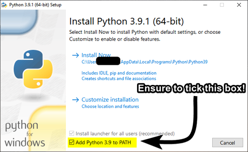

# spotDL Installation Guide

spotDL is a free and open source tool that downloads your Spotify playlists & music

> **The fastest, easiest, and most accurate command-line music downloader**

## Using spotDL


# Using prebuilt executable

### Downloading the executable

You can download the latest version from from the [Releases Tab](https://github.com/spotDL/spotify-downloader/releases)

### Running web ui

Web UI will start by default if no arguments are passed to the command line (after double-clicking for example)


### Running the cli

To use the command line interface just open your terminal and run `./spotdl-vX.X.X operation [urls]`

# Using python

### Prerequisites

- Python 3.7 or above (added to PATH)
- FFmpeg 4.2 or above (added to PATH)
- Visual C++ 2019 redistributable (on Windows)

### Adding Python to PATH

When installing Python, ensure to select "**Add to PATH**".



### Installing FFmpeg

- [Windows Tutorial](https://windowsloop.com/install-ffmpeg-windows-10/)
- OSX - `brew install ffmpeg`
- Linux - `sudo apt install ffmpeg` or use your distros package manager
- Using spotDL - `spotdl --download-ffmpeg` - this will download FFmpeg to spotdl directory.

### Verifying Versions

`python -V` - Should return "Python 3.X.X". Please ensure you have v3.7 or greater.

`ffmpeg -version` - Should return starting with "ffmpeg version YYYY-MM-DD"

### Installing spotDL

You can install spotDL by opening a terminal and typing:

```shell
pip install spotdl
```

If you require further help, ask in our [Discord Server](https://discord.gg/xCa23pwJWY)

[](https://discord.gg/xCa23pwJWY)

# Docker setup

Install docker: <https://docs.docker.com/engine/installation/>

Install docker compose: <https://docs.docker.com/compose/install/>

Docker documentation: <https://docs.docker.com/>

### Usage

### Build-in docker image

- build docker image `docker build -t spotdl .`

- list spotdl options: `docker run --rm spotdl --help`

- download a song: `docker run --rm -v $(pwd):/music spotdl https://open.spotify.com/track/0VjIjW4GlUZAMYd2vXMi3b`

### Docker Hub image

- pull docker image from docker hub: `docker pull spotDL/spotify-downloader`

- download a song using docker image: `docker run --rm -v $(pwd):/music spotDL/spotify-downloader https://open.spotify.com/track/0VjIjW4GlUZAMYd2vXMi3b`

- create a docker container

```
docker create \
  --name=spotdl \
  -v <path to data>:/music \
  spotDL/spotify-downloader
```

### Docker compose
- create a container using docker-compose: `docker-compose up --no-start`

- download a song using docker compose: `docker-compose run --rm spotdl https://open.spotify.com/track/0VjIjW4GlUZAMYd2vXMi3b`

## Where does spotDL download songs?

spotDL downloads files to the folder where you ran spotDL from.

Open pwsh/powershell/cmd/terminal/similar in the folder you want files to download to, or
cd to desired folder.

**Windows Shortcut:** Navigate to the folder you want the files to download to.
`SHIFT + RIGHT CLICK`, then select "Open PowerShell window here"


## We have a public Discord server at **[discord.gg/xCa23pwJWY](https://discord.gg/xCa23pwJWY)!**

[](https://discord.gg/xCa23pwJWY)
